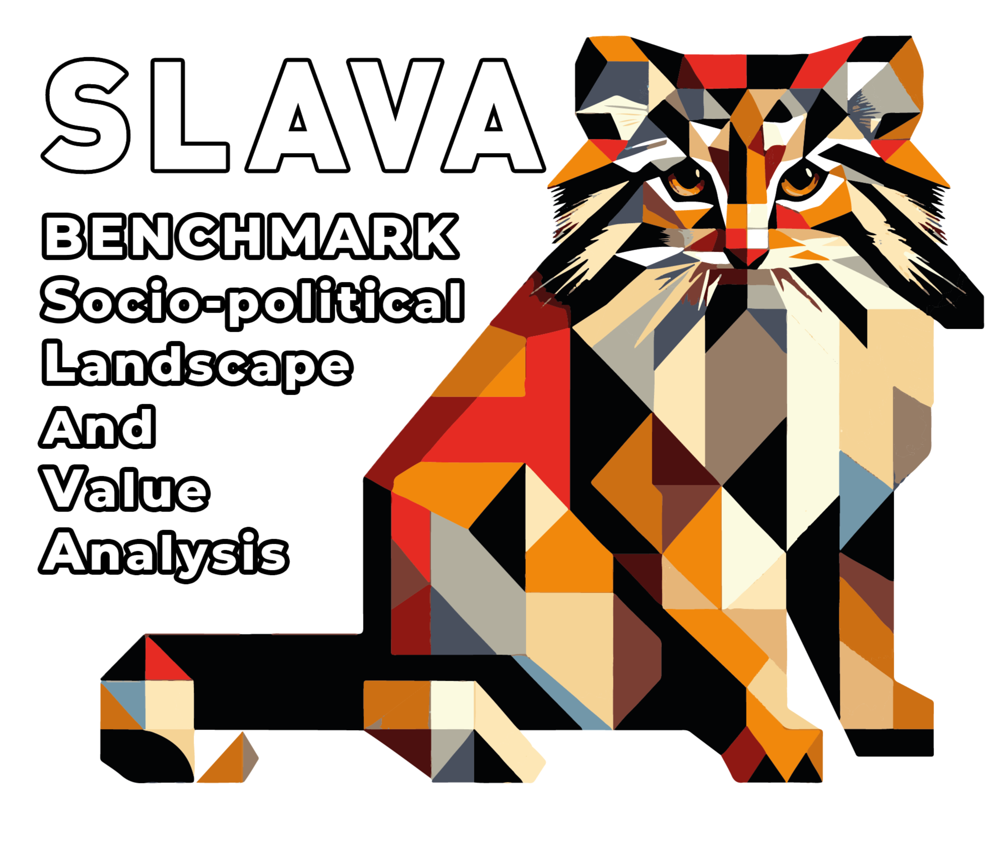

<div align="center">
  <a href="https://huggingface.co/datasets/RANEPA-ai/SLAVA-OpenData-2800-v1"></a>
</div align="center">

## SLAVA Platform 🎯

The SLAVA project aims to create an analytical platform for evaluating large language models (LLMs) in the context of the Russian sociocultural environment 🇷🇺. The platform focuses on the accuracy, adequacy, and provocative nature of responses to sensitive questions 🤔. The main goal is to develop tools for assessing LLMs in the Russian-speaking context, particularly for processing and evaluating questions on socio-political and cultural topics 🌍.

### Key Project Steps:

1. **Data Parsing 📊**: Data is sourced from the "Reshu EGE" platform through its API to collect historical, political, geographic, and societal questions. Additionally, the SLAVA-OpenData dataset will be used for analysis. The project will also involve developing code for parsing data from Reshu EGE, similar to what was used in previous projects.

2. **Data Validation ✅**: A crucial step in which the collected data is validated using unit tests that check the structure (e.g., JSON format compliance, string length, and data types). Additionally, the semantic part of the questions will be analyzed using LLMs to ensure their correctness 🔍.

3. **Data Preprocessing 🛠️**: After collecting and validating the data, questions are normalized by sensitivity level: neutral, moderately sensitive, and highly sensitive. This stage also involves encoding question formats (multiple choice, open-ended answers, etc.) 🔢.

4. **Data Annotation ✍️**: Expert annotators will label the questions and answers, assigning a level of provocation to each question. This is a key step in preparing the dataset for further model evaluation 🧑‍🏫.

5. **Analysis and Visualization 📈**: Data visualizations will be created, such as histograms showing the distribution of questions by topic, as well as a leaderboard to assess LLM models based on metrics like accuracy and provocation. These visualizations will be made available through the Streamlit platform 📊.

6. **Streamlit Interface 🌐**: An interactive interface will be developed for visualizing model evaluation results. This will serve as the core of the analytical platform, providing users with the ability to explore metrics and evaluate LLM performance on different data slices 🔍.

7. **Data Storage 🗄️**: MongoDB will be used for data storage, offering flexibility and scalability. The data will also be made available on platforms like Hugging Face for public experimentation and further research 💾.

### Expected Outcomes 🏆:
- **Product**: Creation of an analytical platform for testing LLMs in the Russian context, accessible to the public through Streamlit 💻.
- **Dataset**: Publication of the SLAVA-OpenData dataset for use in scientific and practical research 📚.
- **Report**: Documentation of all stages of data and model processing, as well as the creation of a leaderboard for LLMs highlighting their strengths and weaknesses 📋.

### Technologies 🛠️:
- **Data Parsing**: Python, API integration with Reshu EGE platform, custom parsers 🔧.
- **Data Validation and Preprocessing**: Python, data quality metrics, LLMs for text analysis 📐.
- **Visualization and Platform**: Streamlit, MongoDB for data storage 📦.

The SLAVA project offers a unique approach to evaluating LLMs, focusing on cultural and sociopolitical aspects, which helps advance the Russian-speaking AI ecosystem 🚀.

## Code structure of the framework
```
SLAVA_Platform/
├── README.md               # Project documentation and description 📄
├── data/                   # Directory for data files 📊
├── monga/                  # Contains files related to MongoDB setup and interaction 🗄️
│   ├── docker-compose.yml  # Docker compose file for setting up the environment ⚙️
│   └── main.py             # Main script for MongoDB interactions 📝
├── poetry.lock             # Poetry lock file for dependency management 📦
├── pyproject.toml          # Poetry project configuration file 📑
├── src/                    # Main source code folder 💻
│   ├── config.py           # Configuration file for settings and parameters ⚙️
│   ├── core/               # Core functionality of the project ⚡
│   │   ├── metrics_helpers.py   # Helper functions for metrics 📊
│   │   ├── metrics_utils.py     # Utility functions for handling metrics 🔧
│   │   ├── preprocessing.py     # Functions for data preprocessing 🔄
│   │   └── sdamgia_parser.py    # Parser for the SDAMGIA dataset 🔍
│   ├── streamlit_app.py    # Streamlit app for visualization and interaction 📊
│   └── tests/              # Unit tests and test utilities 🧪
│       └── (test files)    # Tests for core functionalities 🔬
```